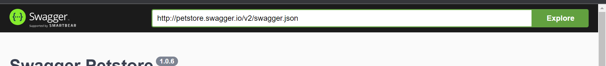
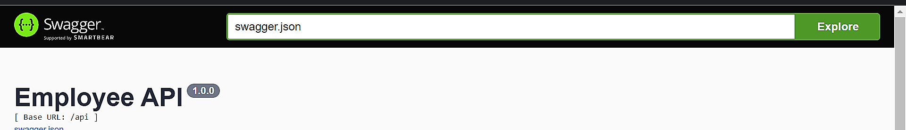

**Commant to run the project**

1. **Auto-generation of documentation ->** bee run -gendoc=true -downdoc=true
   -  **Then visit this url-** http://localhost:8080/swagger/
  
   -  Once you visit then change  url (http://petstore.swagger.io/v2/swagger.json) to this url([swagger.json](url))) then you can get the all api of my project **You can see blow**

"# Employee_API" 
